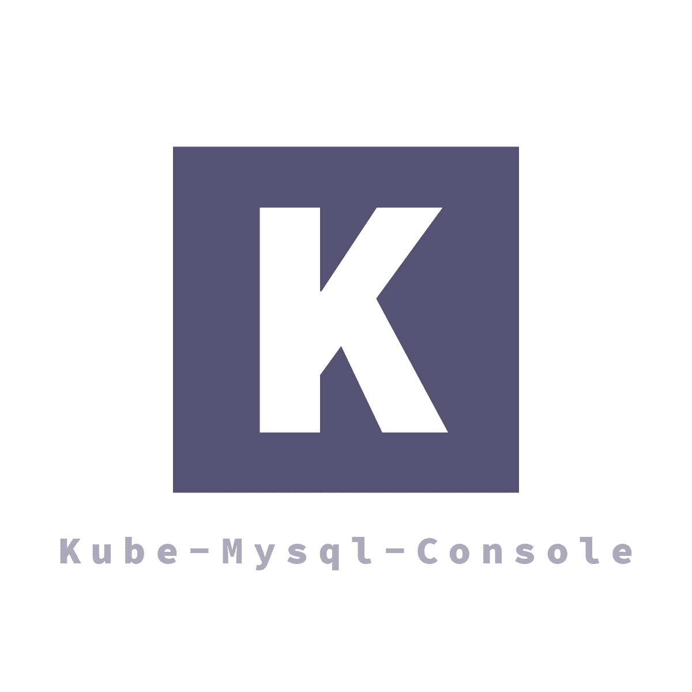
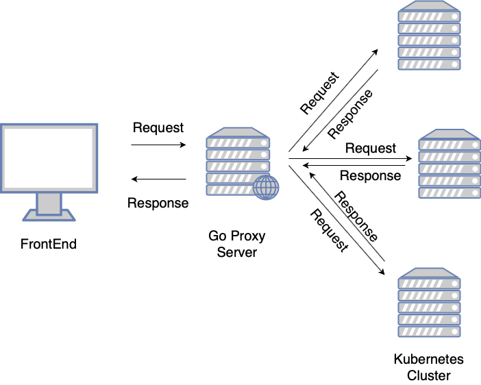

<p align="center">
        
</p>
<p align="center">
    Kube-mysql is a Web Console in order not to use Kubectl 
</p>

## Quick Links 

- [Features](#feature) 
- [Install](#install)
- [Structure](#Structure)
- [References](#Reference)

## Feature

- **Main Page**
- **Details Page**
- Developing....

## Install

**1.** Download Client, Server Codes  

 1. The server code must be located in the same folder path as kube-mysql and kube-common.

**2.** Package Install & Run ( Serverside )

**server**

```
cd server 

go install

go run server.go
```

**client**  

```
cd client

npm install 

npm run start:test 

```

**webpack bundle file execute**

```
cd dist 

In intellij => index.html => open in Browser => chrome 

```

## Structure 

- [Wiki Link](https://wiki.daumkakao.com/pages/viewpage.action?spaceKey=kepcloud&title=Architecture)

<p align="center">
        
</p>

## Reference 

**Cypress** - E2E Test

```
npm run test:cypress
```

- click integration/App.e2e.js 

**StudyFile** - [Files Link](./studyfile/1_StudyFile.md)

