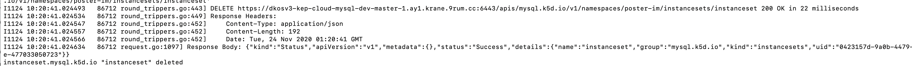
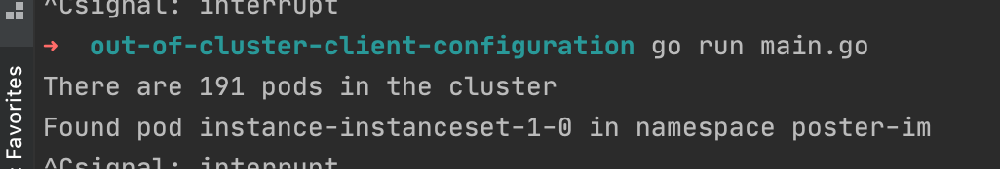

# 1. Kubectl / helm 리소스 올려보기

1. Namespace 생성 
```shell 
kubectl create ns poster-im
```

2. helm, kubectl으로 instanceset 등 리소스들 설치 
    1. helm을 이용한 설치 
    ```shell
    # instanceset 설치
    helm install --dry-run instanceset ./instanceset --set replicas=3 -n poster-im
    ```

    2. kubectl을 이용한 설치 
    ```shell
    # instanceset yaml 내용 확인
    helm template instanceset ./instanceset 

    # yaml 파일 복사 후 붙여넣기 
    vi test_instanceset.yaml 

    # kubectl 명령어로 생성 
    kubectl create -f test_instanceset.yaml -n poster-im
    ```

3. 리소스 edit 

```shell
kubectl edit instanceset instanceset -n poster-im
```

- replicas를 3으로 변경 후 저장하고 종료 


4. 리소스 remove 
```shell
kubectl delete instanceset instanceset -n poster-im
```

5. kubectl -v 옵션 

- [kubectl 출력 로그 상세 레벨 ](https://kubernetes.io/ko/docs/reference/kubectl/cheatsheet/#kubectl-%EC%B6%9C%EB%A0%A5-%EB%A1%9C%EA%B7%B8-%EC%83%81%EC%84%B8-%EB%A0%88%EB%B2%A8-verbosity-%EA%B3%BC-%EB%94%94%EB%B2%84%EA%B9%85)

```shell
kubectl create -f test.yaml -n poster-im -v=9
```

6. helm을 이용한 release uninstall 
```shell
helm uninstall instanceset n poster-im 
```

---

## --v 옵션을 통한 응답 요청 및 확인 

1. kubectl 명령어 성공의 경우 
```shell
k delete -f test.yaml -n poster-im -v=8
```



2. kubectl 명령어 실패의 경우 
```shell
k delete -f test.yaml -n poster-im -v=8
```


--- 

## kubectl 명령어를 통해 얻을 수 있는 리소스 정보들 

- 예시 : kubernetes Client-go 라이브러리를 돌려본 결과 
    - client-go-kubernetes-1.15.11 > out-of-cluster-client-configuration > main.go 
    - https://godoc.org/k8s.io/client-go/kubernetes



- 찾아봐야할 부분 : kubernetes go client tutorial -> google 검색 
    
- kubectl api-resources --namespace=poster-im -o wide  
    - poster-im 네임스페이스에서 사용가능한 리소스 체크 

- kubectl api-versions -n poster-im
    - poster-im 네임스페이스에서 지원가능한 api 버전 출력 

# 참고할 만한 자료 

- https://godoc.org/k8s.io/metrics/pkg/client/custom_metrics
    - crd 자원 정보 추출 
        - 현재 dev 클러스터에서 지원하지 않는다고 하심 ㅠ

- https://godoc.org/k8s.io/kubernetes/pkg/api/v1/pod
    - pod 정보 추출 가능한 패키지 정보 


# 의문점

- 실시간으로 자원 요청하는 데는 너무 비효율적이니 informer 활용이 필요한가?
    - addEventHandler?

    https://godoc.org/k8s.io/client-go/tools/cache

    - 위 링크를 참고해 클라이언트의 부하를 줄일 수 있다고 하는데??
--- 

# CRUD

- Create, get, list, update, delete, patch 명령어를 이용하면 쉽게 해결할 수 있을듯 

---

# Custom Resource Definition

- kubectl describe crd instancesets.mysql.k5d.io
    - instanceset의 CRD를 확인한다. 


- https://getoutsidedoor.com/2020/05/09/kubernetes-controller-%EA%B5%AC%ED%98%84%ED%95%B4%EB%B3%B4%EA%B8%B0/

- https://blog.naver.com/alice_k106/221579974362


- CRD에 어떻게 접근할 것인가?
    - https://github.com/kubernetes/sample-controller

    - https://godoc.org/sigs.k8s.io/controller-runtime


## 프로젝트 내에서 사용하고 있는 CRD 

- CRD?

    - https://blog.naver.com/alice_k106/221579974362


- CR을 정의한 파일
    - https://github.kakaocorp.com/cloud/kube-mysql/blob/master/pkg/mysql/v1/types.go
- Code-Gen에 의해 생성된 코드들
    - https://github.kakaocorp.com/cloud/kube-mysql/tree/master/pkg/generated
- 사용예
    - https://github.kakaocorp.com/cloud/kube-mysql/blob/master/pkg/controller/instance/controller_test.go#L127-L128

- Code-Gen 명령어 
    - https://github.kakaocorp.com/cloud/kube-common/blob/master/hack/build-kubemod.sh#L88-L98

--- 

## Client 와 Server 간에는 어떤 통신 방식을 사용해야 할까?

- REST API, GRPC 후보군들을 생각 중 

 - https://www.freecodecamp.org/news/how-to-use-grpc-web-with-react-1c93feb691b5/

 --- 

 ## 현재 아키텍처에 대한 고민 

 - 과연 어떤 방법이 API 호출을 최소화할 수 있을까?

 - 더 나은 방법은?

 - Grafana ui를 사용해서 react에서 구현해 볼까?
    - https://developers.grafana.com/ui/latest/index.html?path=/story/docs-overview-intro--page
    - https://grafana.com/docs/grafana/latest/packages_api/ui/
    
--- 

## GoLang Gin Framework 설정 

- 왜 Gin Framework인가? 
    - 웹 서버를 올리기 위한 현재 남은 시점에서 가장 큰 star 수를 보유한 framework
    


--- 

## 객체 수정 전 반환 코드 

- API 쪽에서 보여줄 값을 계산한 뒤 View에 쏴주기만 하면 된다고 생각 
- 그러면 나중에 수정 사항이 생길 경우, 서버 단도 바꾸어 주어야 하는 경우가 생김 

```golang

	instanceSetsResult := InstanceSets{}
	
	for _, instancesetObj := range instancesetLists.Items {
		instancesetResult := InstanceSet{}
		instancesetResult.Namespace = instancesetObj.Namespace
		instancesetResult.Name = instancesetObj.Name
		instancesetResult.Replicas = instancesetObj.Spec.Replicas
		if instancesetObj.Spec.Template.Spec.BackupName == nil {
			instancesetResult.Recent_Backup = "No Value"
		} else {
			instancesetResult.Recent_Backup = *(instancesetObj.Spec.Template.Spec.BackupName)
		}
	
		createTime := instancesetObj.CreationTimestamp
	
		getDay := math.Floor(time.Now().Sub(createTime.Time).Hours() / 24.0)
	
		if getDay == 0 {
			instancesetResult.Age = time.Now().Sub(createTime.Time).Round(time.Second).String()
			//fmt.Println(instancesetResult.Age)
		} else {
			instancesetResult.Age = fmt.Sprintf("%.0f", getDay) + "d"
			//fmt.Println(instancesetResult.Age)
		}
		instanceSetsResult.InstanceSets = append(instanceSetsResult.InstanceSets, instancesetResult)
	}

	return instanceSetsResult

```

# WebPack 

- https://www.pluralsight.com/guides/how-to-load-svg-with-react-and-webpack